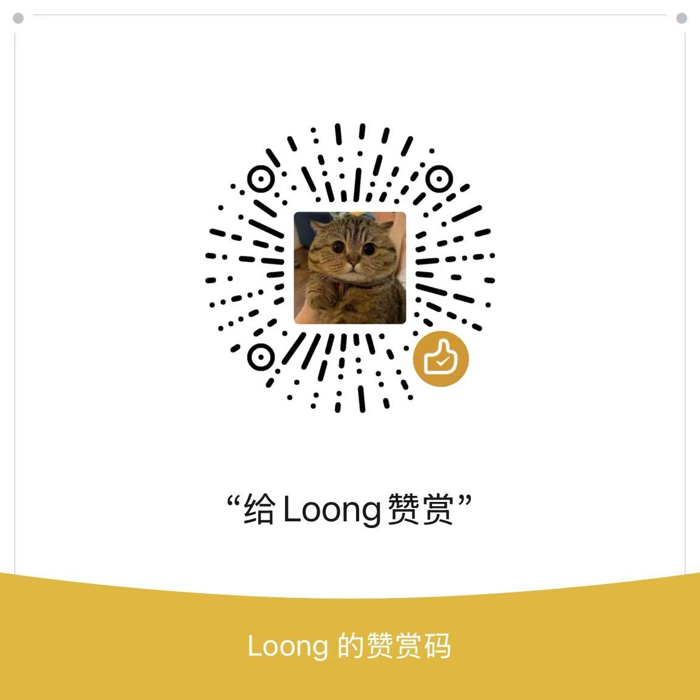

# Coursera Multi-Language Subtitles

A Chrome extension that displays multiple language subtitles simultaneously on Coursera, with customizable language selection and display order.

中文版本: [README.md](README.md)

## Features

- **Auto-enable**: Automatically activates selected subtitles when entering a Coursera video page
- **Multi-language**: Display any number of subtitle languages at the same time, not limited to two
- **Fixed order**: Subtitles are stacked in your configured order from top to bottom, no more random arrangement
- **Custom languages**: Select any combination of languages from the tracks available in the current video
- **Reorder**: Use ▲▼ buttons to adjust which language appears on which line
- **Persistent settings**: Language preferences are saved to Chrome sync storage and applied automatically across videos
- **SPA compatible**: Automatically re-applies when navigating between videos within Coursera

## Installation

1. Download or clone this repository
2. Open Chrome and go to `chrome://extensions/`
3. Enable **Developer mode** in the top-right corner
4. Click **Load unpacked** and select the project folder

## Usage

Open any Coursera video page — the extension will automatically detect and enable subtitles.

Click the extension icon in the toolbar to:

- Check/uncheck subtitle languages to display (multiple selections supported)
- Use ▲▼ buttons to adjust the vertical display order of each language
- Click **Re-apply** to manually trigger if auto-detection fails

Defaults to English (line 1) + Simplified Chinese (line 2). If the video provides more languages, you can add them as additional lines.

## Examples

| Selected languages | Result |
|---|---|
| English → Chinese (Simplified) | English on top, Chinese below |
| English → Chinese (Simplified) → 日本語 | Three lines: English / Chinese / Japanese |
| Chinese (Simplified) → English | Chinese on top, English below |

## File Structure

```
├── manifest.json   # Extension config (Manifest V3)
├── content.js      # Core content script injected into the page
├── popup.html      # Extension popup UI
├── popup.js        # Popup interaction logic
├── assets/         # Static assets
└── icons/          # Extension icons
```

## Support

If you find this extension helpful, feel free to buy me a coffee ☕


